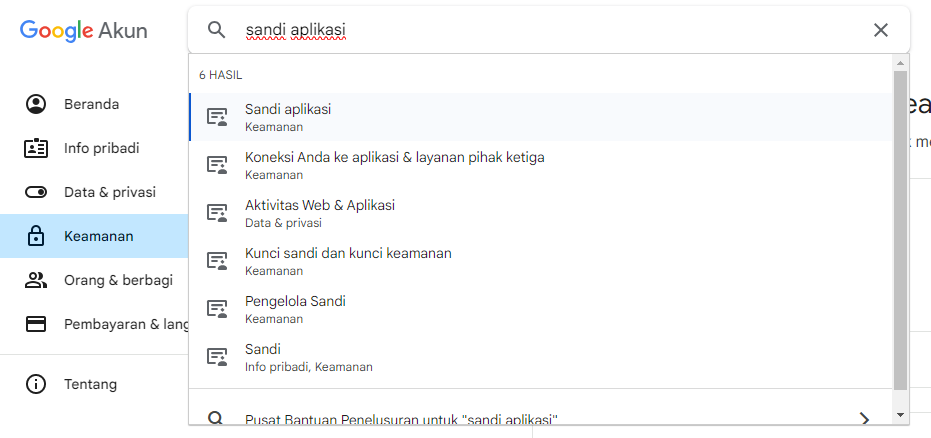
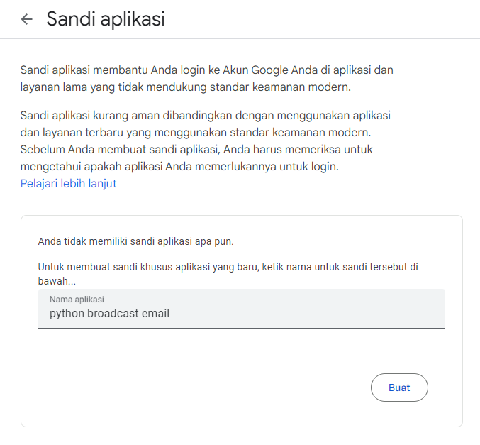
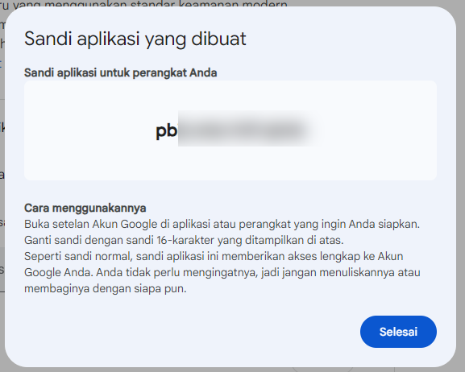

# **Broadcast Email using python SMTP**

## **Description**
This broadcast email program uses the `smtplib` python library to send emails. This program can read excel files and parse data as needed.

## **Feature**
<details>
  <summary><b>File reading from excel</b></summary>
    Can read data from excel. We can set what sheet and header the data is in. Example: 
  <table>
    <thead>
      <tr>
        <th>NamaTim</th>
        <th>Email</th>
      </tr>
    </thead>
    <tbody>
      <tr>
        <td>fathuy</td>
        <td>your@email.com</td>
      </tr>
      <tr>
        <td>LUKITO</td>
        <td>example@mail.com</td>
      </tr>
    </tbody>
  </table>

  ```python
  xl = pd.read_excel(file_path, sheet_name='Sheet1')
  mail_to = xl['Email'].tolist()
  team_list = xl['NamaTim'].tolist()
  ```
  The code will return the value as a list. <br>
  `mail_to` = `['email1', 'email2', ...]` <br>
  `team_list` = `['team1', 'team2', ...]`
    
</details> 

<details>
  <summary>Adding file attachments</summary>
  We can add file attachments, and we can customize them using python `glob` library
</details>


## **How to use**
1. Make sure your Google account has 2 Factor Authentication (2FA) **enabled**.  If not, you can visit the following [link](https://support.google.com/accounts/answer/185839)
2. Open your [Google Account](https://myaccount.google.com/). Then,  search '*application password*' in the search bar.

3. Set your app password. and give it a name

4. Generate a password, and assign it to the `password` variable

